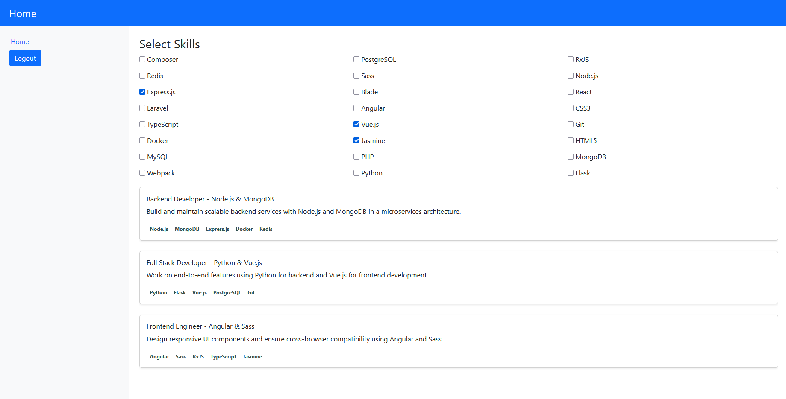

# JMatch - Skill-Based Job search

A simple job matching Spring Boot web app. Users can register/login and search jobs according to a list of selected skills they input.

## Technologies

- **Backend:** Java, Spring Boot, Spring Security, JWT, Maven
- **Frontend:** Vue 3, Axios, Bootstrap

### Prerequisites

- Java 17+
- Node.js + npm
- Maven

## How to run

- mvn clean install
- java -jar target/JMatch-1.0-SNAPSHOT.jar
